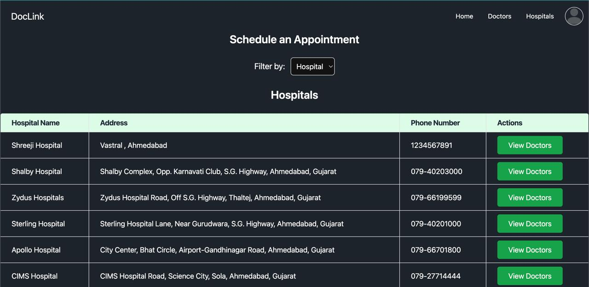
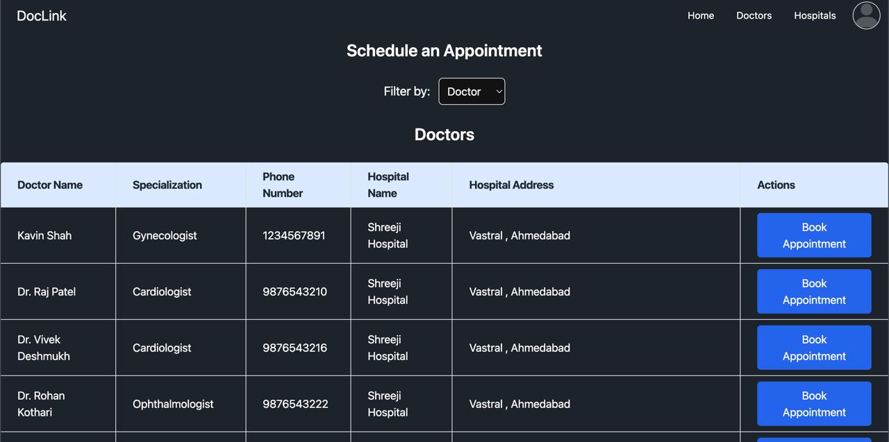
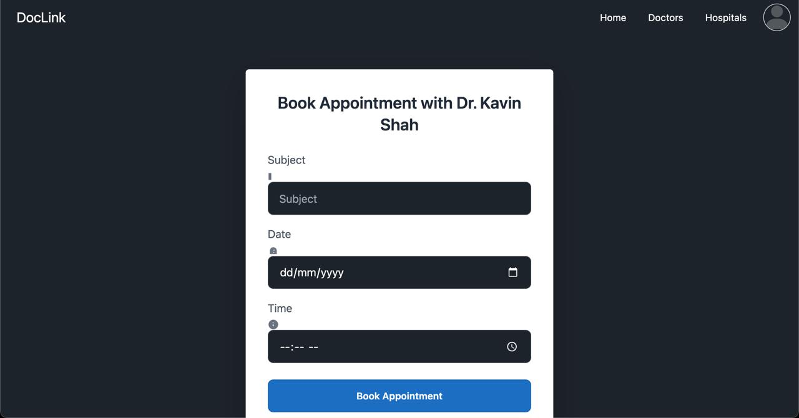
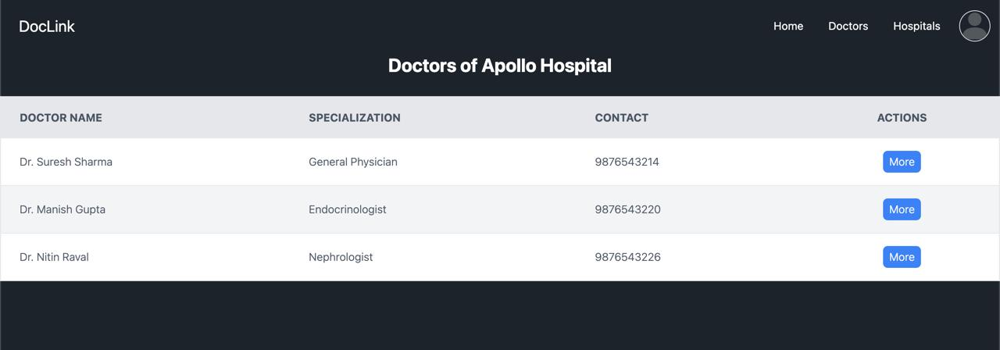
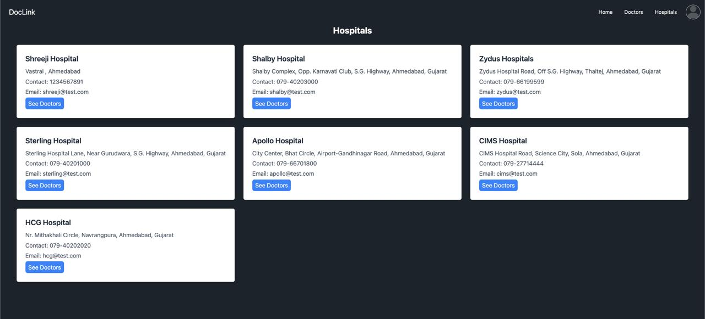

# DocLink

## Project Overview

***DocLink*** is a web application developed using the ASP.NET MVC framework with SQL Server as the backend. The primary goal of this application is to streamline the appointment scheduling process between patients and doctors, making it efficient and easy to manage for both parties, including hospitals.

## Features

### Patient Module:
- View previous appointments.
- Schedule new appointments by selecting a doctor or hospital.
- Choose the appointment date, time, and add a subject for the appointment.
- Track appointment status (pending/approved).

### Doctor Module:
- Login to the system (account created by the hospital).
- View today's appointments.
- Approve or reject appointments (default status: pending).

### Hospital Module:
- View today's appointments for all doctors.
- View the list of doctors associated with the hospital.
- Create doctor accounts.

## Roles

### Patient:
- Can register and log in to schedule appointments.
- Can view past and upcoming appointments.

### Doctor:
- Can log in to view appointments assigned for the day.
- Can approve or reject appointments.

### Hospital:
- Can create doctor accounts.
- Can view appointments scheduled for doctors in their hospital.
- Can manage doctors and appointments.

## Database

The application uses **SQL Server** to store all data related to users, appointments, doctors, and hospitals. The key entities in the database are:
- Patients
- Doctors
- Hospitals
- Appointments

## Setup Instructions

### 1. Open the Project
- Clone or download the repository and open it in **Visual Studio**.

### 2. Set Up the Database
- Create a new SQL Server database.
- Update the connection string in the `appsetting.json` file:
- "ConnectionStrings": {
  "DbName": "Server=localhost;Database=DbName;User ID=root;Password=;"
}
### 3. Run Migrations
- Run EF CORE migrations to manually create the necessary tables in the SQL Server database based on the application's models.
### 4. Build and Run the Application
- Build the project in Visual Studio to resolve dependencies.
- Run the application using IIS Express or your preferred local web server.
### Technologies Used
- ASP.NET MVC - For building the web application.
- SQL Server - For database management.
- Tailwind CSS - For front-end design and responsive UI.

### ScreenShots 

